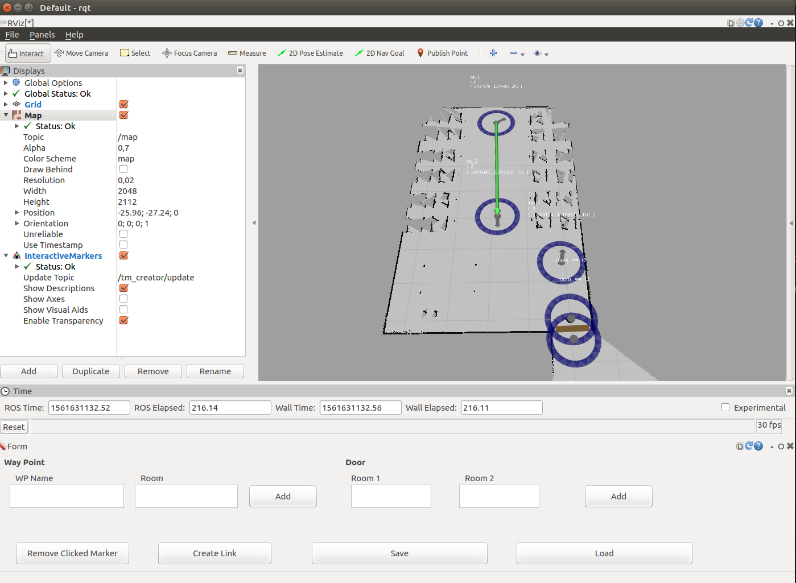

# Topological Map Creator
**Topological Map Creator simplifies the task of build a topological map of a scenario.**

Using this tool you could create in a simple way a topological map with waypoints and doors. The output of the tool will be a .yaml file that could be use by the **topological_navigation**.

## Packages

- topological_map_creator
- topological_map_creator_msgs

## Summary

- **Maintainer:** Jonatan Ginés <jonatan.gines@urjc.es>
- **Author:** Jonatan Ginés <jonatan.gines@urjc.es>
- **License:** BSD
- **ROS Distro:** Kinetic
- **Dependencies:**
  - **ROS Standard:** rospy, roscpp, std_msgs, tf, rqt_gui, rqt_gui_cpp, interactive_markers, roslint, actionlib, yaml-cpp, map_server

## You should know

You can create three types of markers: waypoint, door and link.
- **Waypoint:** Each waypoint represents an interest point in a room. You can customize its position and orientation.
- **Door:** A door is compose by two waypoints, pre-door waypoint and post-door waypoint, and connects two rooms.
- **Link:** If you have waypoints in different rooms but without a door separating them you can connect them with a link.

If you have many waypoints in the same room **not it's necessary** connect them.

## Use
```
roslaunch topological_map_creator tm_creator.launch

```

Example of a simple setup to use topological map creator. We can open two plugins in Rqt_gui, one for Rviz and one for the topological map creator interface. **Remember add a visualization of InteractiveMarker and select /tm_creator/updates as topic to display the topological markers in Rviz**



### Creating a wp:
Write a name and a room and click in **Add**. The waypoint marker will be create in the origin of the map. You can move it clicking and dragging in the marker.

### Creating a door:
In same way we can create a wp, we can create a door. Complete the form with the rooms and click in **Add**.

### Creating a link:
To create a link:
  1. Click in the wp origin.
  2. Click in Create Link option.
  3. Click in the wp goal.

### Removing a marker:
Click in the marker that you want remove and then click in Remove option.

## Output
When you save your topological map, a .yaml file will be created with the name "topological_map.yaml" in the selected directory.
